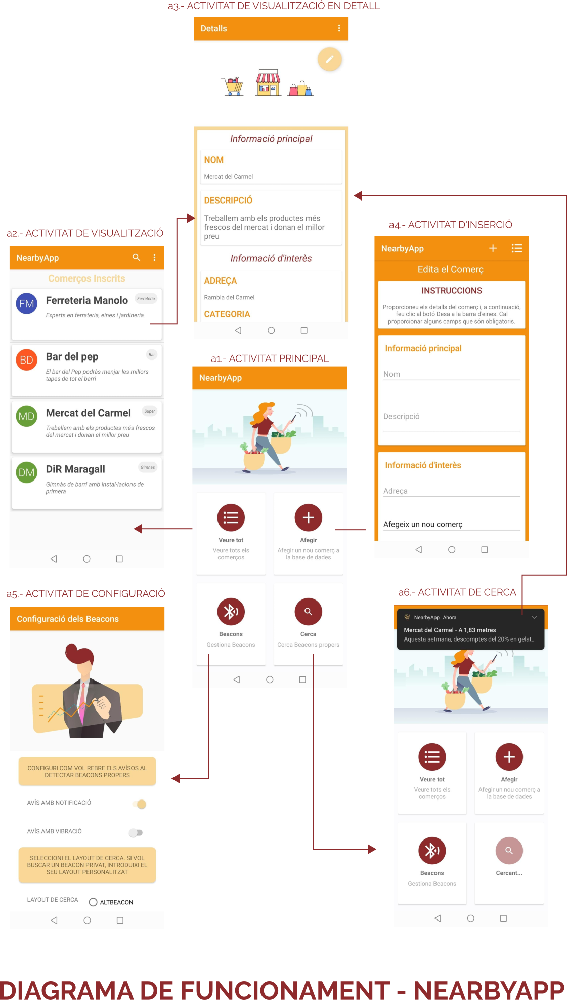

# NearbyApp
Final degree project, which aims to be a demo of the potential of Beacon technology applied to commerce, specifically to local commerce.

### The app has 4 main functionalities:

- *BeaconSettings* -> You can define the beacon protocol, (now is only enable Altbeacon protocol) and some settings about this

- *StartDetectingBeacon* -> Allows you to activate / deactivate the detection of Beacons and receive notifications of the commerce found

- *ShowCommerce* -> Allows you to see, in a recyclerview, all the added shops and see them in detail

- *AddCommerce* -> Allows you to add new commerces in the database, linked to Firebase, and add new ids and beacons notifications.

 

[View the entire presentation of the project](https://docs.google.com/presentation/d/1hJ6nnSEM0kcwbc6c7nZOCVWkU_Kt3khPl5_sbazopHc/edit?usp=sharing)

  

